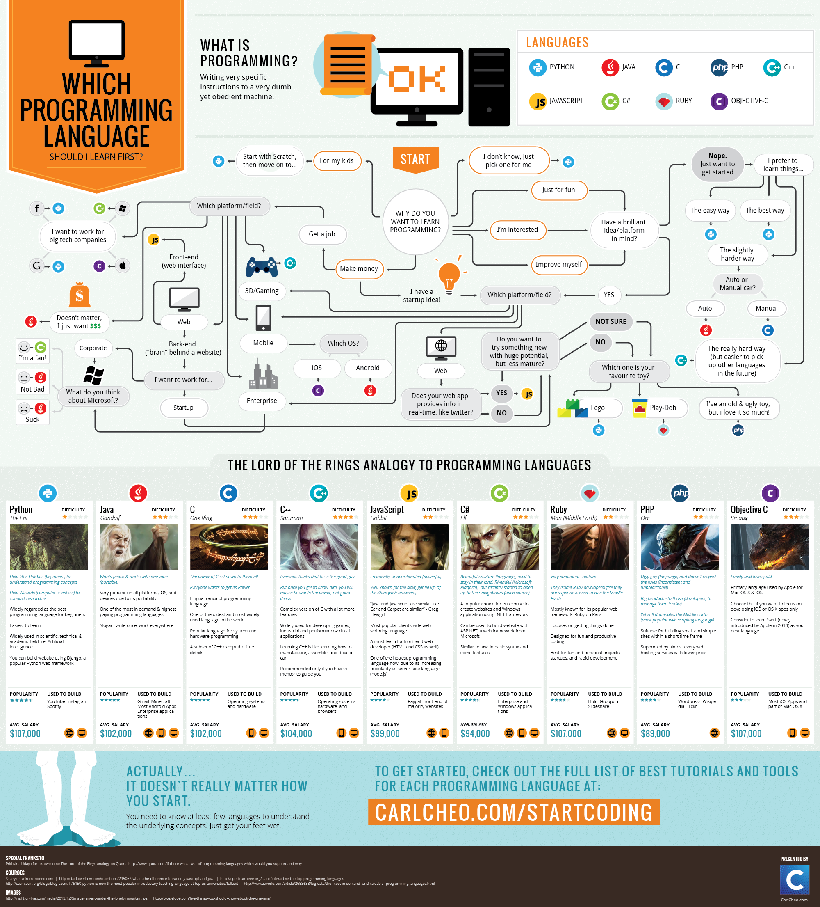

# Języki programowania

Nie istnieje jeden najlepszy język programowania, od którego powinno się zacząć naukę. Chociaż niektórzy twierdzą, że jest nim angielski. Aktualnie istnieje jednak sporo materiałów dostępnych w naszym języku, dzięki którym można bez problemu zacząć naukę.

Pamiętaj proszę, że wybór języka, od którego rozpoczniesz swoją naukę wcale nie jest aż tak ważny. Zdecydowana większość testerów i programistów pracuje z więcej niż jednym językiem.

{% embed data="{\"url\":\"http://carlcheo.com/startcoding\",\"type\":\"link\",\"title\":\"Which Programming Language Should I Learn First? \[Infographic\]\",\"description\":\"Before choosing your first programming language, you should also check out this infographic on What Is Programming And What Do Programmers Do.  So you want\",\"icon\":{\"type\":\"icon\",\"url\":\"http://carlcheo.com/wp-content/uploads/2014/07/favicon.ico\",\"aspectRatio\":0},\"thumbnail\":{\"type\":\"thumbnail\",\"url\":\"http://carlcheo.com/wp-content/uploads/2014/12/which-programming-language-should-i-learn-first-infographic.png\",\"width\":2000,\"height\":2210,\"aspectRatio\":1.105}}" %}

Na początku najważniejsze jest zrozumienie podstaw programowania, na przykładzie wybranego języka. Następnie nauczenie się kolejnego języka będzie znacznie łatwiejsze.

{% embed data="{\"url\":\"https://nofluffjobs.com/blog/jezyki-programowania-w-pracy-testera-ktorych-warto-sie-nauczyc/\",\"type\":\"link\",\"title\":\"Języki programowania w pracy testera — których warto się nauczyć?\",\"description\":\"Języki programowania w pracy testera - sprawdź, które z nich są najczęściej wymagane przez pracodawców, a tym samym - których z nich warto się nauczyć!\",\"icon\":{\"type\":\"icon\",\"url\":\"https://nofluffjobs.com/favicon.ico\",\"aspectRatio\":0},\"thumbnail\":{\"type\":\"thumbnail\",\"url\":\"//nofluffjobs.com/blog/wp-content/uploads/2017/09/a34ea-14\_mfcjztfppa-7ogy-nluq.png\",\"width\":800,\"height\":417,\"aspectRatio\":0.52125}}" %}

### 📚 Materiały

* [What Selenium Programming Language You Should Learn](https://www.joecolantonio.com/2015/05/31/selenium-what-programming-language-you-should-learn-to-get-into-test-automation/) 
* [What Programming Language to learn for Test Automation](https://www.froglogic.com/blog/what-programming-language-to-learn-for-test-automation/) 
* [Język skryptowy dla testera](http://testerzy.pl/baza-wiedzy/testerzy-testerom-19-jezyk-skryptowy-dla-testera) 🌞
* [Rozwój kariery testera. Czy warto przejść na stronę programistyczną?](http://testerzy.pl/baza-wiedzy/rozwoj-kariery-testera-programowanie) 🌞
* [Jaki język programowania dla początkujących](http://www.qa-courses.com/stranica-posta/2016/10/25/Jaki-jezyk-programowania-jest-dla-poczatkujecych) 🌞
* [What Programming Language Should a Beginner Learn in 2018](https://www.codementor.io/codementorteam/beginner-programming-language-job-salary-community-7s26wmbm6)

###  Dyskusje

* [Jaki język dla web i mobile?](https://www.facebook.com/groups/TestowanieOprogramowania/permalink/1139129899442920/)
* [Na jaki język jest największy popyt?](https://www.facebook.com/groups/TestowanieOprogramowania/permalink/1411316595557581/)
* [Python czy Java dla QA?](https://www.facebook.com/groups/TestowanieOprogramowania/permalink/1704663669556204/)

