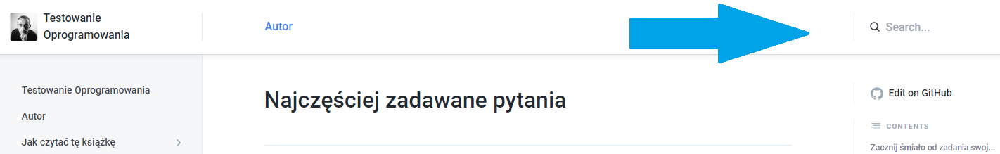

# Najczęściej zadawane pytania

## Zacznij śmiało od zadania swojego pytania w wyszukiwarce

Jeżeli Twoje zapytanie nie zwróci wyników, zostanę o tym poinformowany i postaram się zamieścić poszukiwane przez Ciebie materiały w kolejnej aktualizacji dokumentu :)

## Jak w ogóle zacząć naukę, jakie materiały polecacie na początek?


[od-czego-zaczac](od-czego-zaczac/)


## Czy nadaję się na testera?


[od-czego-zaczac](od-czego-zaczac/)


## Jak wygląda praca testera?


[historie](historie/)



[od-czego-zaczac](od-czego-zaczac/)


## Jak zostać testerem? Jak wygladają historie ludzi, którzy zostali testerami?


[historie](historie/)


## Jakie pytania można dostać na rozmowie kwalifikacyjnej?


[pytania-na-rozmowie.md](szukanie-pracy/pytania-na-rozmowie.md)


## Jak zaplanować swoją naukę?


[plan-nauki](plan-nauki/)


## Jak znaleźć pierwszą pracę lub staż?


[pierwsze-doswiadczenie.md](od-czego-zaczac/pierwsze-doswiadczenie.md)



[szukanie-pracy](szukanie-pracy/)


## Jak i gdzie zdobyć pierwsze doświadczenie?


[pierwsze-doswiadczenie.md](od-czego-zaczac/pierwsze-doswiadczenie.md)


## Nie mogę znaleźć pracy jako tester, dlaczego?


[szukanie-pracy](szukanie-pracy/)


## Jak powinno wyglądać CV testera?


[cv.md](szukanie-pracy/cv.md)


## Ile zarabia tester?


[zarobki.md](zarobki.md)


## Chcę nauczyć się testowania, rozpocząć pracę jako tester. Czy polecacie kurs X?


[kursy-online.md](kursy-online.md)


## Chcę nauczyć się testowania, rozpocząć pracę jako tester. Czy polecacie studia X?


[kursy-online.md](kursy-online.md)


## Jaki kurs/warsztat w mieście X dla początkującego testera?


[kursy-online.md](kursy-online.md)



[kursy-fizyczne.md](kursy-fizyczne.md)


## Jaki kurs/warsztat on-line dla początkującego testera?


[kursy-online.md](kursy-online.md)


## Gdzie zrobić kurs przygotowujący do ISTQB?


[istqb.md](certyfikacja/istqb.md)


## Na jakie zarobki mogę liczyć mając X lat doświadczenia i znając X narzędzi?


[zarobki.md](zarobki.md)


## Praca zdalna. Czy jako tester mogę pracować zdalnie?


[praca-zdalna.md](praca-zdalna.md)


## Czy warto zdawać certyfikat ISTQB?


[istqb.md](certyfikacja/istqb.md)


## Jakie materiały do nauki ISTQB?


[istqb.md](certyfikacja/istqb.md)


## Czy warto iść na szkolenie do egzaminu ISTQB?


[istqb.md](certyfikacja/istqb.md)


## Gdzie najtaniej zdać egzamin ISTQB?


[istqb.md](certyfikacja/istqb.md)


## Chce nauczyć się automatyzacji, co dalej?


[automatyzacja](automatyzacja/)


## Jakie materiały do nauki automatyzacji polecacie?


[automatyzacja](automatyzacja/)


## Jakie materiały do nauki Selenium z wykorzystaniem języka X polecacie?


[selenium.md](narzedzia/selenium.md)


## Jakiego języka programowania nauczyć się najpierw?


[nauka-programowania](automatyzacja/nauka-programowania/)


## Studia podyplomowe z testowania oprogramowania, czy to się opłaca?


[studia-z-testowania.md](studia-z-testowania.md)


## Na jakich stronach mogę potrenować testowanie lub automatyzację?


[gdzie-trenowac.md](gdzie-trenowac.md)


## Czy w mieście X jest organizowany meetup lub konferencja?


[spolecznosci-testerskie.md](gdzie-szukac-wiedzy/spolecznosci-testerskie.md)


## Chce nauczyć się języka X, jakie materiały polecacie?


[nauka-programowania](automatyzacja/nauka-programowania/)


## Jak zacząć testować stronę web?


[testowanie-stron-web](testowanie-stron-web/)


## TODO

* Co muszę umieć z ISTQB, żeby zacząć pracę?
*
