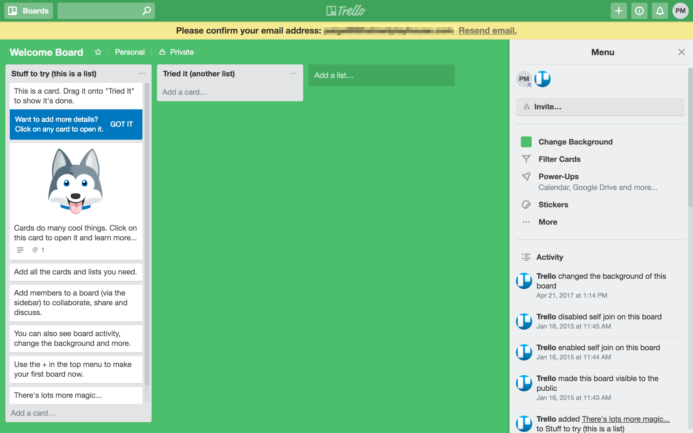

# Plan nauki

Stworzenie planu nauki, którym będziesz podążać może oszczędzić Ci sporo czasu. Wyselekcjonowanie materiałów i rozłożenie ich w czasie pozwoli określić cel i ścieżkę, którą należy podążyć, aby go osiągnąć.

Tworząc swój plan można skorzystać z jednego z wielu dostępnych narzędzi, które ułatwią usystematyzowanie zadań.

Dobrym przykładem takiego narzędzia jest [Trello.com](http://trello.com)

## Przykładowe plany

Pamiętaj proszę, że poniższe plany są tylko przykładami i mogą nie sprawdzić się w Twoim przypadku. Przemyśl dokładnie co chcesz osiągnąć i dostosuj do tego swoje siły!

Nie ma jednego dobrego sposobu na rozpoczęcie nauki testowania, wejście w świat IT, czy nauczenie się automatyzacji. Przedstawione tutaj przykładowe plany są ogólne i nie wyczerpują w żaden sposób tematu. Stanowią one, choćby częściową, próbę odpowiedzi na często pojawiające się pytanie "Chcę zostać testerem, jak zacząć?". Na przykład tak.

## Czy na pewno?

Czy na pewno chcesz zostać testerem? Odpowiedz sobie na to pytanie ponownie, po zapoznaniu się ze wszystkimi materiałami i wykonaniu zadań z tablicy.



## Wejście w IT

Jeżeli chcesz wejść w świat IT bez żadnego wcześniejszego doświadczenia. Spróbuj tej ścieżki.



## Testowanie

Wiesz, że chcesz zacząć testować, że chcesz dostać w tym pracę. A może już udało Ci się dostać pierwszą pracę, jednak chcesz przerobić podstawy?



## Automatyzacja

Jeżeli chcesz rozpocząć naukę automatyzacji.



## 📚 Materiały do trello

* [Kanban 101: How to Use Kanban Boards to Manage Your Next Project](https://zapier.com/learn/project-management/kanban-board/) 
* [Przykładowa tablica, która jest także wprowadzeniem do możliwości Trello](https://trello.com/b/I7TjiplA/trello-tutorial) 
* [Bardzo dobrze przygotowane przykłady tablic w Trello](https://trello.com/inspiration) 

## 📚 Planowanie nauki

* [How to get started in software testing](http://thesocialtester.co.uk/how-to-get-started-in-software-testing-a-few-resources/) 
* [The secrets to getting started in your software testing career](http://searchsoftwarequality.techtarget.com/tip/The-secrets-to-getting-started-in-your-software-testing-career) 
* [Get started in software testing](https://testlio.com/blog/post/get-started-software-testing) 
* [Non-IT to software testing switch - How to get into QA](http://www.softwaretestinghelp.com/non-it-to-software-testing-switch-how-to-get-into-qa/) 
* [Software testing for freshers](http://www.softwaretestingtricks.com/2007/05/software-testing-for-freshers-tested.html) 
* [How to Become the MacGyver of Software Testing: Learning from Scratch](https://netguru.co/blog/quality-assurance-means) 

## \*\*\*\* **Dyskusje**

* [Jak ułożyć sobie przyswajaną wiedzę](https://www.facebook.com/groups/TestowanieOprogramowania/permalink/1745867432102494/)

