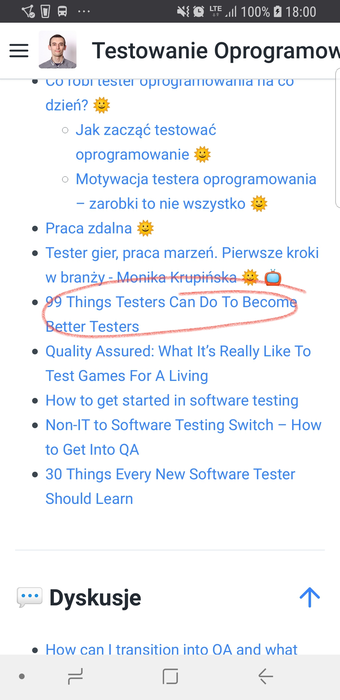

# Rozwój materiałów

## Poprzez GitHub

Zapraszam do wysyłania **pull requestów** ze zmianami do repozytorium, które po przeglądzie i zaakceptowaniu zostaną następnie zsynchronizowane z obecną wersją książki.



Wszelkie błędy i sugestie także można zgłaszać poprzez zakładkę [Issues](https://github.com/pwicherski/TestowanieOprogramowania/issues)**.**

## Poprzez Google Forms

{% embed data="{\"url\":\"https://goo.gl/forms/DwkDkOFwg9KchbQ42\",\"type\":\"rich\",\"title\":\"Zgłoszenie\",\"icon\":{\"type\":\"icon\",\"url\":\"https://ssl.gstatic.com/docs/forms/device\_home/android\_192.png\",\"width\":192,\"height\":192,\"aspectRatio\":1},\"thumbnail\":{\"type\":\"thumbnail\",\"url\":\"https://lh6.googleusercontent.com/bZFZqL6OnD-RPTpHnQWXzFjO1jHkALc-4J0hIa21EsNzkBeJPTbk5fClGRNwOkkqznU=w1200-h630-p\",\"width\":200,\"height\":200,\"aspectRatio\":1},\"embed\":{\"type\":\"app\",\"url\":\"https://docs.google.com/forms/d/e/1FAIpQLSedgspOAcVbm1t1-Lp7tvB-6p6\_O20xjJns6lg8mxqLH61AJA/viewform?usp=send\_form&embedded=true&usp=embed\_googleplus\",\"html\":\"
<iframe src=\\\"https://docs.google.com/forms/d/e/1FAIpQLSedgspOAcVbm1t1-Lp7tvB-6p6\_O20xjJns6lg8mxqLH61AJA/viewform?usp=send\_form&amp;embedded=true&amp;usp=embed\_googleplus\\\" style=\\\"border: 0; top: 0; left: 0; width: 100%; height: 100%; position: absolute;\\\" allowfullscreen></iframe>
\",\"aspectRatio\":0.7071}}" %}

## Tablica planowanych zmian, które wejdą do kolejnej wersji



## Zgłaszanie przez zrzut ekranu

### Android

{% embed data="{\"url\":\"https://www.greenbot.com/article/2825064/android/how-to-take-a-screenshot-on-your-android-phone.html\",\"type\":\"link\",\"title\":\"How to take a screenshot on any Android phone\",\"description\":\"Once an arduous task, taking a screenshot is a snap—no pun intended—on modern Android phones. Here\'s how to do it on your phone.\",\"icon\":{\"type\":\"icon\",\"url\":\"https://idge.staticworld.net/grb/greenbot-logo-144x144.gif\",\"width\":144,\"height\":144,\"aspectRatio\":1},\"thumbnail\":{\"type\":\"thumbnail\",\"url\":\"https://images.idgesg.net/images/article/2017/07/lg-g6-screenshot-100728814-large.3x2.jpg\",\"width\":700,\"height\":467,\"aspectRatio\":0.6671428571428571}}" %}

{% embed data="{\"url\":\"https://lifehacker.com/5994516/how-to-take-a-screenshot-on-android\",\"type\":\"link\",\"title\":\"How to Take a Screenshot on Android\",\"description\":\"Taking a screenshot of your Android phone&\#39;s screen can be a bit confusing, since the process isn&\#39;t the same on every device. Here are the different ways to take a screenshot on Android.\",\"icon\":{\"type\":\"icon\",\"url\":\"https://i.kinja-img.com/gawker-media/image/upload/s--OqAhAoNZ--/c\_fill,fl\_progressive,g\_center,h\_200,q\_80,w\_200/u0939doeuioaqhspkjyc.png\",\"aspectRatio\":0},\"thumbnail\":{\"type\":\"thumbnail\",\"url\":\"https://i.kinja-img.com/gawker-media/image/upload/s--bHjn256\_--/c\_fill,fl\_progressive,g\_center,h\_900,q\_80,w\_1600/18kf10mu9ughzjpg.jpg\",\"width\":1600,\"height\":900,\"aspectRatio\":0.5625}}" %}

### iOS

{% embed data="{\"url\":\"https://support.apple.com/en-ca/HT200289\",\"type\":\"link\",\"title\":\"How to take a screenshot on your iPhone, iPad, and iPod touch\",\"description\":\"Learn how to capture the screen on your iOS device, and add drawings or text with Markup.\",\"icon\":{\"type\":\"icon\",\"url\":\"https://support.apple.com/favicon.ico\",\"aspectRatio\":0},\"thumbnail\":{\"type\":\"thumbnail\",\"url\":\"//support.apple.com/library/content/dam/edam/applecare/images/en\_US/social/feature-how-to-take-a-screenshot-0917.jpg/\",\"width\":1200,\"height\":630,\"aspectRatio\":0.525}}" %}

#### Zaznacz problem na zrzucie ekranu

#### Dopisz o co chodzi, następnie wyślij do mnie:

* [https://m.me/pwicherski](https://m.me/pwicherski)
* [https://www.facebook.com/pwicherski](https://www.facebook.com/pwicherski)
* [https://www.linkedin.com/in/pwicherski/](https://www.linkedin.com/in/pwicherski/)
* [https://twitter.com/PWicherski](https://twitter.com/PWicherski)

