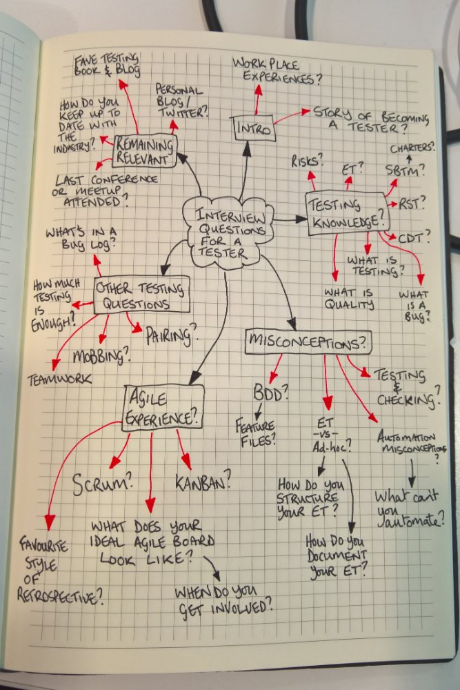

# Rozmowa rekrutacyjna

### 📚 Materiały

* [How I interview testers](https://www.linkedin.com/pulse/how-i-interview-testers-dan-ashby)&#x20;
* [Kilka porad rekrutacyjnych](https://arturzwolinski.gitbooks.io/software-tester-interview/content/)

###  **Dyskusje**

* ["Rozmowa rekrutacyjna" - lista dyskusji w grupie Testowanie Oprogramowania](https://www.facebook.com/hashtag/rekrutacja?\_\_gid\_\_=141683635854223) 🏤
  * Tutaj znajdziesz listę dyskusji, w których członkowie grupy zadają pytania na temat rozmów rekrutacyjnych.
* [Jakie były najciekawsze pytania albo krótkie zadania rekrutacyjne z jakimi się spotkaliście?](https://www.facebook.com/groups/TestowanieOprogramowania/permalink/1021871111168800/)&#x20;
* [Jak może wyglądać rozmowa](https://www.facebook.com/groups/TestowanieOprogramowania/permalink/1042626019093309/)&#x20;
* [Kilka przykładowych pytań rekrutacyjnych](https://www.facebook.com/groups/TestowanieOprogramowania/permalink/1296258673730041/)&#x20;
* [Kilka przykładowych pytań rekrutacyjnych](https://www.facebook.com/groups/TestowanieOprogramowania/permalink/1105074382848472/)&#x20;
* [Jakie pytania techniczne mogą paść na rozmowie kwalifikacyjnej na stanowisko junior testera manualnego](https://www.facebook.com/groups/TestowanieOprogramowania/permalink/1769794973043073/)&#x20;
